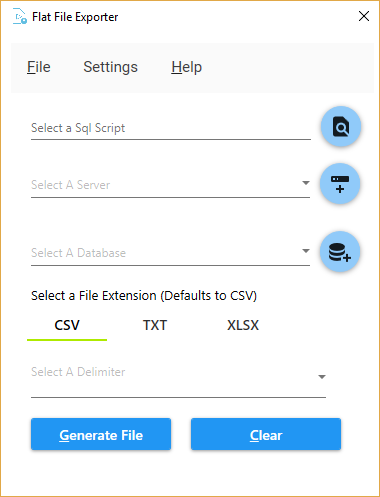
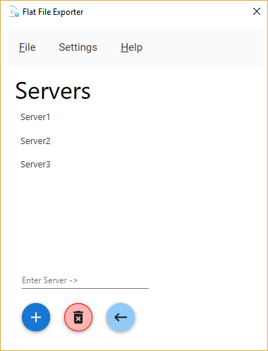
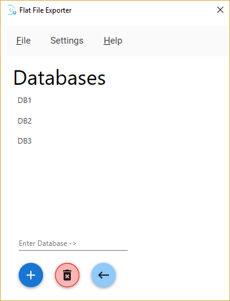
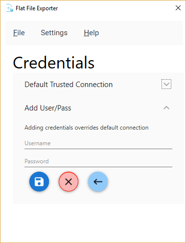

# Flat File Exporter
---
[Home](README.md) | [Releases](https://github.com/eddyizm/flatfileexporter/releases) | [Issues](https://github.com/eddyizm/flatfileexporter/issues)

---

## Overview 

Reads a sql script or calls a stored procedure and exports results to a csv, txt or excel file. The GUI is limited to a SQL script and currently exports to the same location where the SQL script is called from. The CLI allows more flexibility such as specifying the export directory, file name and the ability to call a stored procedure on the database.

Support  
 
[](https://ko-fi.com/L3L01HI5A)

**CRITICAL NOTE**
SQL scripts require   
`SET NOCOUNT ON`  
at the top of the script, else the python/pandas based engine will fail with the query results. 

Output file will have date appended for GUI and CLI, eg.
> GUI  
`FFE_OUTPUT_<YYYYMMDD>.<EXT>`

> CLI  
`<FILENAME_SUPPLIED>_<YYYYMMDD>.<EXT>` 


Supported extensions: 
* txt
* csv
* xlsx
  
Supported delimiters:  
* pipe ( | )
* comma ( , )
* tab ( )

## Requirements 

* ODBC Driver 17 for SQL Server
* Microsoft .NET Framework 4.6.1 

If you don't have it on your system, please install ODBC Driver 17 for SQL Server here:
https://www.microsoft.com/en-us/download/details.aspx?id=56567  

Update .Net Framework here:  
https://www.microsoft.com/en-us/download/details.aspx?id=49981


# GUI 
---
 

The server and database has a dummy value, `Server1` and `DB1`. 
You will need to specify your actual server by clicking on the plus and going to the Add A Server screen. 

 

Add your databases...

 

### Credentials

By default Flat File Exporter uses Microsoft's ODBC Driver 17 for SQL Server and the Trusted_Connection=yes setting, passing the credentials of the user along to the db. This is standard practice in Enterprise environments that relay on AD to manage permissions. If you enter credentials below then your default credentials will be ignored."

 

---
# Command Line Interface (CLI)  

The CLI is far more powerful and allows passing a stored procedure. You can also call the exe directly to schedule file exports along with calling it programmatically to go through loops over large amounts of variables and data.

#### Location
The CLI can be found in the Program folder, in the Resources folder

> [AppRoot]\Resources\flatfile_cli.exe

### CLI usage

Sample calls

`flatfile_cli.exe <SERVER> <DATABASE> "C:\Users\BOB\Desktop" -csv -c -s "C:\Users\BOB\Desktop\sample_query.sql"`

 where <SERVER> and <DATABASE> is your system,   
`"C:\Users\BOB\Desktop"` -- The output directory  
`-csv` specifies a .csv file  
`-c` requests a comma delimited file  
`-s` switch specifies a sql script and requires a path/file  
`"C:\Users\BOB\Desktop\sample_query.sql"` requested above


Full usage

```
usage: flatfile_cli.exe [-h] [-V] [-f FILENAME] [-u USERNAME] [-pass PASSWORD]
                       (-csv | -txt | -xlsx) (-c | -t | -p)
                       (-s SQLSCRIPT | -sp STOREDPROC)
                       server db directory

Takes sql script or stored proc to export csv, txt or excel file.

positional arguments:
  server                server to run query against.
  db                    database to use on server.
  directory             location to export flat file. do not specify
                        extension.

optional arguments:
  -h, --help            show this help message and exit
  -V, --version         show programs version number and exit
  -f FILENAME, --filename FILENAME
                        filename. Date will be appended.
  -u USERNAME, --username USERNAME
                        username for db connection.
  -pass PASSWORD, --password PASSWORD
                        use login/pass from instead of default Integrated
                        Security (Trusted_Connection).
  -csv, --csv           output file with csv extension.
  -txt, --txt           output file with txt extension.
  -xlsx, --xlsx         output excel file.
  -c, --comma           use comma character for seperator.
  -t, --tab             use tab for seperator.
  -p, --pipe            use pipe character for seperator.
  -s SQLSCRIPT, --sqlscript SQLSCRIPT
                        full path of sql script *MUST HAVE* SET NO COUNT on
                        script.
  -sp STOREDPROC, --storedproc STOREDPROC
                        instead of sql script, point to stored procedure on
                        database. Wrap in double quotes with parameters eg.
                        "EXEC SAMPLE_SP '<Param>'"
```                        

